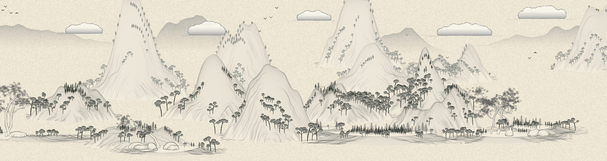
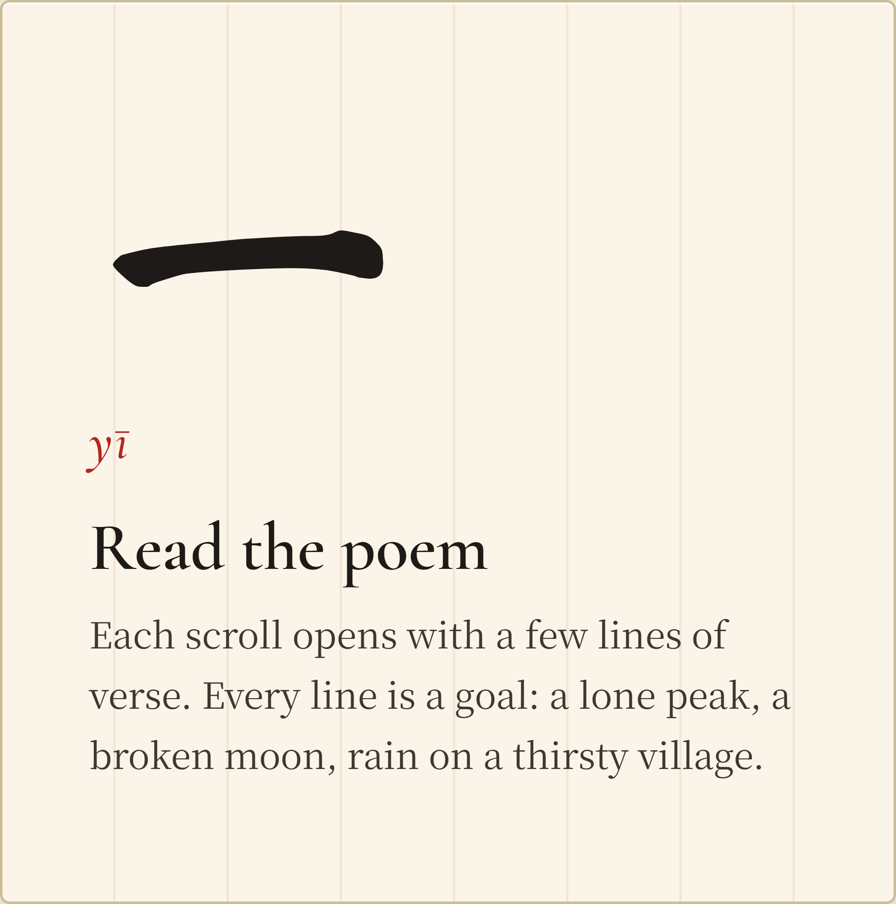
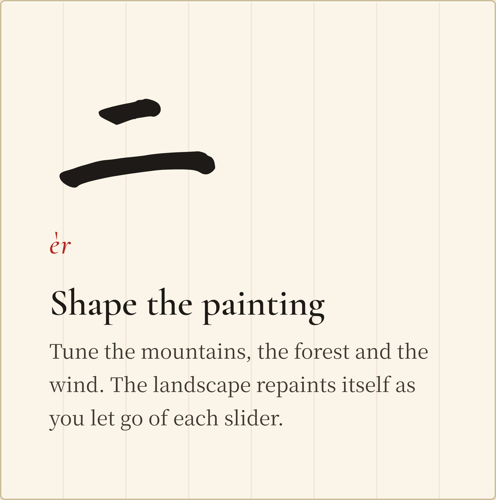
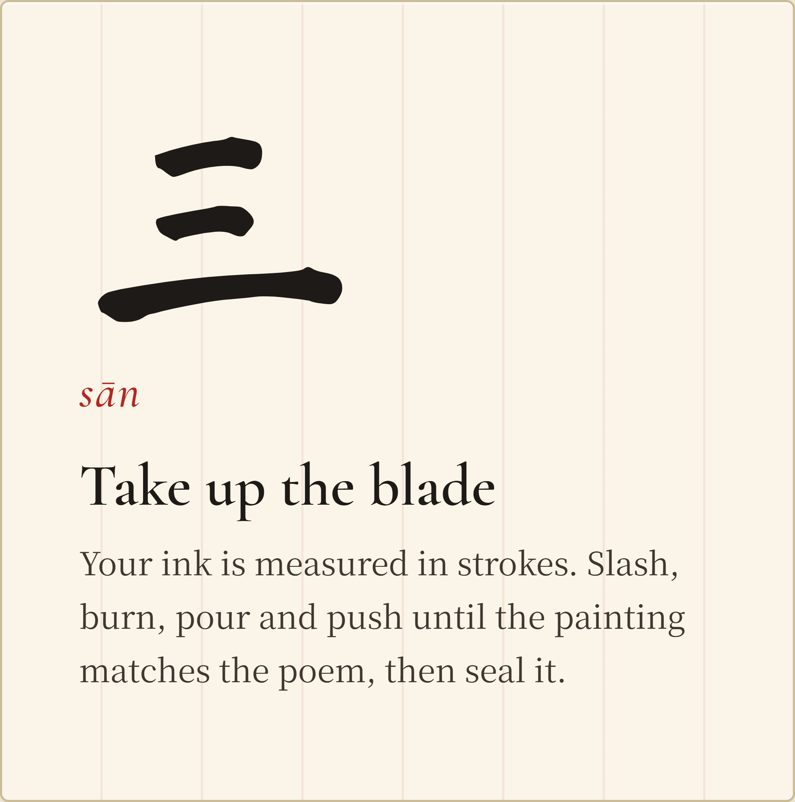

<p align="center">
  
  <br /><br />
  
</p>

<p align="center"><b>Zhan-Shui (斬山水): cut the mountains, carve the water.</b></p>

<p align="center"><a href="https://evandongchen.github.io/BladeAndBrush/"><b>Play it in your browser</b></a> · <a href="https://evandongchen.github.io/BladeAndBrush/tutorial.html">Tutorial</a> · <a href="https://evandongchen.github.io/BladeAndBrush/gallery.html">Gallery</a></p>



## About

Blade & Brush is a puzzle game set inside a Chinese ink landscape painting, a *shan-shui* (山水, "mountain and water"). Every scroll is painted fresh: mountains, forests, plateaus, clouds and distant ridges are generated from a seed and unroll across the screen as if drawn by an unseen brush.

The painting is alive. Under the ink, every speck of the landscape is a grain of material (rock, wood, leaf, water, fire, smoke) that falls, burns, flows and breaks like the real thing. Cut through a mountain and the piece you severed tumbles down the slope. Light a grove and the fire spreads from tree to tree. Pour water and it runs downhill, pools in the valleys and puts out the flames.

Each scroll comes with a poem, and your task is to make the painting match it.

## How to play



**Read the poem.** Each scroll opens with a few lines of verse, and every line is a goal: one peak standing alone, a moon cleaved in two, rain falling on a thirsty village, a caged swarm set free. A line lights up when the painting fulfils it.



**Shape the painting.** Before you touch the blade, tune the landscape itself. Raise or lower the mountains, spread them apart, thicken the forest, turn the wind. The scroll repaints itself each time you let go.



**Take up the blade.** Your ink is measured in strokes, so every one counts. Drag to aim a stroke, hold to charge it, and release to strike:

| | Ability | What it does |
|---|---|---|
| 斬 | **Slash** | Cuts rock and wood. Whatever you cut loose falls. |
| 推 | **Push** | Hurls loose rock, sand and water along the line. |
| 火 | **Fire** | Lights wood and leaves. Flames spread on their own. |
| 水 | **Water** | Drops a sheet of water that runs downhill and douses flame. |
| 無 | **Null** | Quietly wipes a strip away: no scar, no splatter. |

When the painting matches every line of the poem, press your seal onto it. Finished paintings can be signed and hung in the [gallery](https://evandongchen.github.io/BladeAndBrush/gallery.html) next to everyone else's, with the fewest-stroke solution for each scroll marked 最少.

**New to the game?** The [tutorial](https://evandongchen.github.io/BladeAndBrush/tutorial.html) walks you through each stroke and each force of nature one lesson at a time, and every lesson has a *Show me* button that plays it for you.

## The scrolls

| | Scroll | Poem |
|---|---|---|
| 一 | **The Peak** | *One peak alone holds up the sky, no lesser hill may reach half its height; three trees still rest upon its feet.* |
| 二 | **The Eclipse** | *Cleave the moon above the pass, one peak to guard it on each side; let fire take the forest.* |
| 三 | **The Drought** | *Lead the water down the stone, let fire meet it, and the cloud bring rain upon the roofs; and spare every villager.* |
| 四 | **The Trap** | *Open the stone and let the caged swarms fly, wake the spring to fill a pond for them to drink; and leave no trapper on the land.* |

## How it works

- **A painted generator.** Each landscape is generated from a seed: layered mountains with ink outlines, texture strokes and washed shading, forests of several tree species, plateaus with rocks, huts and villages, misty far ridges and clouds. Mountains sit on several depth planes, so cutting through a near one reveals the one behind it.
- **A falling-sand world underneath.** The painting is a grid of cells, and the art is only ever shown where its cell still exists. Physics, fire, water, wind, gravity, falling rigid pieces and little creatures all act on that grid.
- **A scanner that reads the painting.** Peaks, trees, water, villagers and more are measured straight from the cells, which is how the poem knows whether you have fulfilled it.
- **Everything is deterministic.** The same seed and the same strokes always give the same painting, so finished paintings can be replayed and verified.

Built with TypeScript, Vite and the Canvas 2D API, with no game engine or UI framework.

## Running it locally

```sh
npm install
npm run dev     # then open http://localhost:5173/
npm test
```

## Credits

The landscape generator is inspired by [shan-shui-inf](https://github.com/LingDong-/shan-shui-inf) by Lingdong Huang (MIT). It served as reference reading only; no code from it is used in this project.
